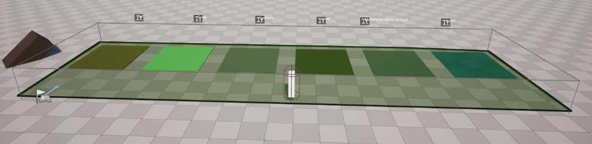
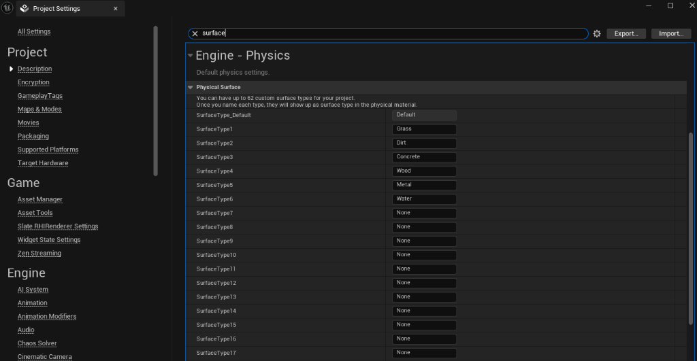

# 🦶 ProtoReady: Footstep System

> **[UE 5.5+]** **[C++]** **[Production-Ready]**

A high-performance, DataAsset-driven footstep solution built for Unreal Engine. Engineered for C++ efficiency, this system offers a streamlined workflow that eliminates the need for Blueprint dependencies while maintaining full designer control.

---

## 🚀 Key Capabilities

- **Component-Based Architecture**: Seamless integration via the `PRFootstepComponent`.
- **Physics-Driven Detection**: Automatically identifies surface types using the Physical Materials system.
- **Versatile Trace Options**: Sphere, Line, Box, and Multi-trace methods.
- **Dual Triggering Mechanisms**: AnimNotify (Animation-Driven) or Distance (Procedural).
- **Advanced Audio**: Spatialization, Attenuation, and random modulation (Pitch/Volume).

---

## 🛠️ Integration Guide

### 1. Installation & Setup
1. Place `PR_Footstep` in your `Plugins` folder and enable it.
2. Define **Physical Surfaces** in `Project Settings > Engine > Physics`.

### 2. Configuration
Create a `PRFootstepData` asset to map surfaces to sounds and configure trace settings.

### 3. Usage
Attach the `PRFootstepComponent` to your Character.
- **AnimNotify**: Insert the `PR_Footstep` notify into your Locomotion animations.
- **Distance Mode**: Set `TriggerMode` to *Distance* for automatic triggering.

---

## 📦 Package Contents

- **PRFootstepComponent**: Lightweight C++ Actor Component.
- **20+ Footstep Audio Samples**: A selection of varied footstep sounds (Concrete, Dirt, Grass, Wood, Water) ready for prototyping.
- **Showcase Level**: Fully configured demo environment.

---

## 🔧 Technical Specifications

### Classes
- **`UPRFootstepComponent`** (`UActorComponent`):
  - The core logic engine. Handles tick updates (for distance checking), trace execution, and sound spawning.
  - Optimized to minimize overhead when not moving or out of range (LOD).
- **`UPRFootstepData`** (`UPrimaryDataAsset`):
  - Central configuration file. Stores all impact sounds, trace parameters, and audio settings.
  - Decoupled from logic allows for easy swapping (e.g., Heavy vs Light boots).

### Blueprint API
The system exposes several key functions to Blueprint for gameplay logic:

*   **`TriggerFootstep(FName SocketName)`**:
    *   *Description*: Manually force a footstep trace/sound from a specific socket.
    *   *Use Case*: Landing events, special animation moments, or cutscenes.

*   **`SetFootstepInterval(float NewInterval)`**:
    *   *Description*: Updates the distance required to travel before automatically triggering a step (Distance Mode only).
    *   *Use Case*: Changing gait from Walk (120cm) to Run (200cm).

*   **`GetFootstepInterval()`**:
    *   *Description*: Returns the current interval distance.

*   **`SetTriggerMode(EPRFootstepTriggerMode NewMode)`**:
    *   *Description*: Switches between AnimNotify and Distance modes at runtime.

---

## 📄 License

Released under the **MIT License**. Authorized for commercial utilization.
(c) 2026 ProtoReady Pack
