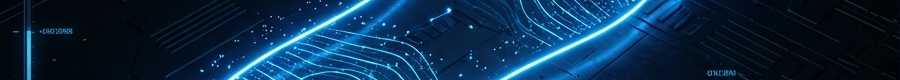
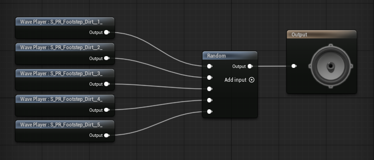

# ProtoReady : Système de Pas

 
 

> **Système de sons de pas prêt pour la production, configuré en moins de 5 minutes.**
>
> *   Composants **Drag-and-drop**
> *   **Auto-configuration** via DataAssets
> *   **Zéro code** (boilerplate) requis
> *   **Quick start** clair (< 5 min)
> *   **Tooltips** dans l'éditeur

  

---

## ⚡ Fonctionnalités Clés

*   **Configuration Zéro-Code** : Strictement piloté par DataAsset. Les designers gèrent la configuration, pas la logique.
*   **Interaction Physique** : Valide automatiquement les surfaces via `PhysicalMaterials`, empêchant les "bruits de pierre sur de l'herbe".
*   **Polyvalence des Traces** : Options Sphere, Line, Box et Multi-trace pour une détection précise.
*   **Déclenchement Hybride** : **AnimNotify** (image précise) ou **Distance** (calculée procéduralement).
*   **Mixage Audio** : Support complet de la Spatialisation, de l'Atténuation et de la modulation aléatoire.

---

## Installation (Setup)

1.  **Activez le plugin** : Edit > Plugins > ProtoReady Footstep.
2.  **Définissez vos Surfaces Physiques** : Edit > Project Settings > Engine > Physics > Physical Surface.
3.  **Ajoutez le `PRFootstepComponent`** à votre Character (ou n'importe quel Actor).
4.  **Créez un DataAsset `PRFootstepData`** et assignez-le au composant.

*Exemples de surfaces : Concrete, Dirt, Grass, Water, Wood. S'il n'existe qu'un seul `PRFootstepData`, il est auto-assigné à la création.*

---

## Comment ça marche

### Déclenchement des pas
*   **AnimNotify (piloté par l'animation)** : Ajoutez la notify `PR_Footstep` à vos animations. La notify expose `FootSocketName` et est disponible immédiatement.
*   **Distance (auto)** : Déclenche un pas tous les `DistanceInterval` cm parcourus. En mode Distance, le Tick est activé automatiquement.

### Réception (Landing)
*   `bAutoTriggerLand` se lie automatiquement au `ACharacter::LandedDelegate`.
*   `LandingSound` est utilisé s'il est défini ; sinon le système joue un son de pas standard avec le flag landing.

### Traces & surfaces
*   La détection de surface se fait par trace sur un **Canal de Collision Configurable** (Défaut : `ECC_Visibility`).
*   Les surfaces proviennent du **Physical Material** du mesh. S'il est manquant, `SurfaceType_Default` est utilisé.
*   `DefaultSound` est le son de repli utilisé lorsque la surface n'est pas mappée ou qu'aucun Physical Material n'est trouvé.

---

## Contenu du Package

*   **PRFootstepComponent** : Actor Component C++ léger.
*   **PRFootstepData** : DataAsset de configuration.
*   **20+ Samples Audio** : Béton, Terre, Herbe, Bois, Eau.
*   **5 SoundCues** & Matériaux Physiques.
*   **Niveau de Démonstration (Showcase)**.

---

## Spécifications Techniques

### Classes
*   **`UPRFootstepComponent`** (`UActorComponent`) : Moteur logique central (Tick, Trace, Spawn). Optimisé avec LOD.
*   **`UPRFootstepData`** (`UPrimaryDataAsset`) : Conteneur de configuration central.

### Blueprint API

Le système expose des fonctions clés pour la logique de gameplay :

| Noeud | Description | Cas d'usage |
| :--- | :--- | :--- |
| **Set Trigger Mode** | Basculer entre la logique `AnimNotify` et `Distance` au runtime. | Patrouille NPC vs État de combat. |
| **Set Footstep Interval** | Changer la distance parcourue pour déclencher un pas. | Marche vs Course. |
| **Trigger Footstep** | Forcer une trace de pas unique immédiatement. | Cinématiques ou événements de réception. |

---

## Licence

**MIT License**.
(c) 2026 ProtoReady Pack
